# `pinapl` - PIcaso Nano Application Platform in Lua

>*A Lua library to let your code talk to a $29 serial touch-display module. And on top of that, another library to help you build simple apps with dialogs, listboxes, on-screen keyboard and more. Quickly and cheaply get a good-looking user interface on anything that has a serial port.*

*written by Rop Gonggrijp*

## introduction

I've always liked playing with minimal computers and networking. Running OpenWRT (a Linux distribution) on cheap wireless access points was a thing long before cheap and small computing platforms such as the Raspberry Pi, BeagleBone or C.H.I.P. came along. Even with these more powerful systems around, there are still applications where you might want to resort to access points and similar systems. Maybe you need lots of Ethernet ports, maybe you're building something appliance-like that you'd like to use a super-small wireless module for, maybe you'd like to create something that runs a minimal amount of code for security reasons, or whatever other reason you have.

But suppose you want to build something with its own user interface. Something completely minimal. Say all you want is to enter an IP-number or pick a wifi network to use and enter the WPA key. Now you're almost forced to use a Raspberry Pi with a special display HAT, or a Beaglebone Black with a display cape, or something similar. And such a system with such a display is wonderful: you can make it do amazing things. The displays are connected to the system using SPI, so they are fast and they have a framebuffer interface so you can even use a framebuffer web-browser or run Xwindows on them. On access points and the like you are often stuck: not every system gives you easy access to an SPI-port. And if it does, you may have to compile kernel modules of varying code quality, the touch screen might have a separate port, etc, etc.

This project takes a different path. **`pinapl`** (pronounced "pineapple") provides an extremely easy way to create decent-looking functionality using a touch-screen module that has a bit of built-in intelligence and hooks up to anything that can provide a 5 volt supply and has a 5V or 3.3V level serial port available. It uses Lua, a very lightweight programming language. The Lua interpreter, the libraries and the code for the example from the video all together use up around 200 kilobytes of storage on my OpenWRT system.

[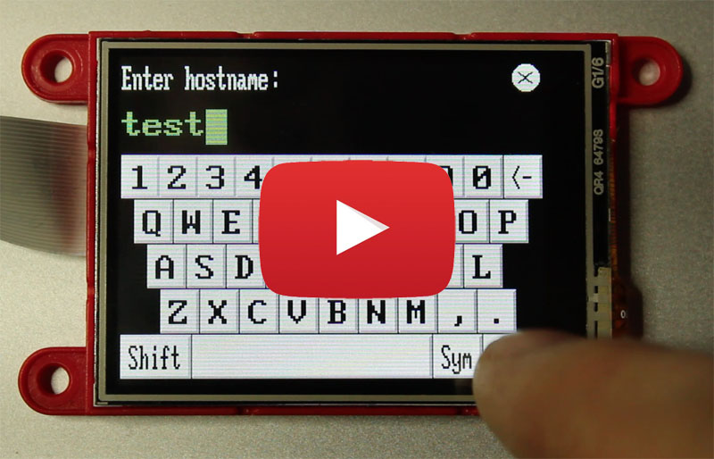](http://www.youtube.com/watch?v=k3sRRXSDI7Y)

This one-minute video shows the `example.lua` demo application, the code is shown a little bit further down in this text.

## the display

I chose to play with the [gen4-uLCD-24PT](http://www.4dsystems.com.au/product/gen4_uLCD_24PT/), a 29 USD display module made by a company called [4D-Systems](http://www.4dsystems.com.au) from Australia. They make a lot of display modules for various systems and applications. The cheapest display they have is the 2.4 inch touch screen that I am using for this project. It has 320x240 resolution and the touch screen is resistive. What that means is that you have to push a little harder than on your smartphone, and there's no multi-touch or anything fancy like that. The custom chip they made for it is called Picaso, hence the name of this project.

The display costs USD 29 if you buy from 4D-systems directly, but it is also carried by quite a few distributors. I bought two of these displays from [Digi-Key](https://www.digikey.com/product-detail/en/4d-systems-pty-ltd/GEN4-ULCD-24PT/1613-1119-ND/5823653), for 60 euros total including shipping (to Berlin, Germany). [Mouser](http://eu.mouser.com/search/ProductDetail.aspx?R=0virtualkey0virtualkeygen4-uLCD-24PT) also carries it, as do many other distributors.

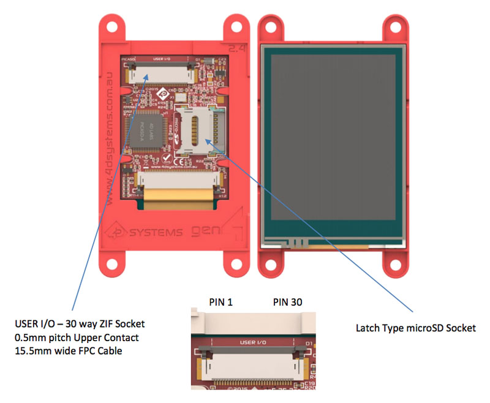

As you can see above, the module has a 30-way ZIF-socket to connect to a flat cable. Fortunately, the display ships with that cable and a small interface board so we don't have to make a circuit board with one of those connectors on it.

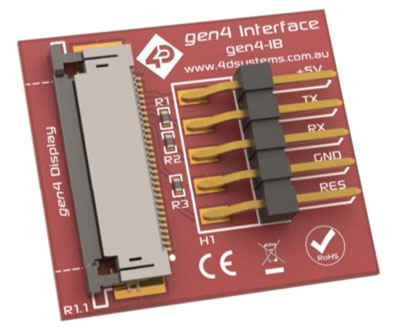

The interface board has five header pins (marked +5V, TX, RX, GND and RES, the latter being an active-low reset pin), at the normal 2.54 mm distance. The display, at 2.4 inch diagonal, is quite small. That said, even typing on a small on-screen QWERTY-keyboard works remarkably well. (I mean: don't plan to write your thesis on it, but it'll do fine if you are entering passwords or short messages.)

| parameter | value |
| :---- | :---------- |
| Weight | ~21 g|
| Input Voltage: | 4.0 - 5.5 V |
| Power consumption | 150 mA at 5.0 V (typ) |
| Display Viewing Area | 48.96 x 36.72 mm |
| Resolution | 320 x 240 pixels |
| Colour | 16 bits per pixel, 5-6-5 |

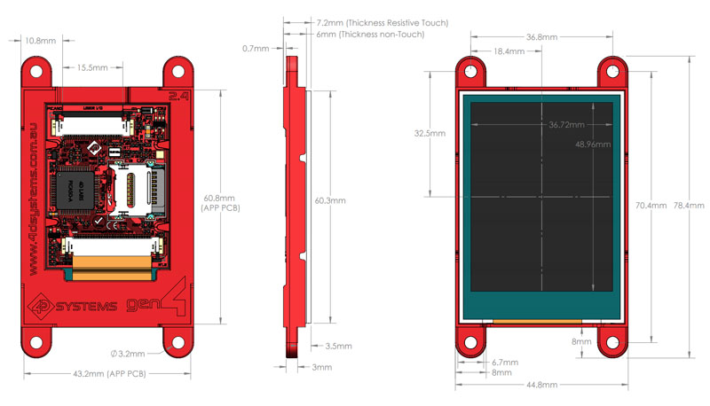

Important to note about the display is that the people that built it have their own ideas about how to use it. For one the device has a micro SD-card slot that I have not used yet. It can be used to store images, movies and sound files that the display can then show or play. (There's no speaker but there is a sound output pin on the 30-pin wide flat cable.) 4D-Systems also makes a pretty-looking closed-source Windows IDE that allows you to write code directly on the tiny processor in the display. It also has an interface library with pretty knobs and dials, it allows for conversion of Windows fonts to the device, etc, etc.

I'm not presently using any of these features in `pinapl`, although I have implemented all the necessary functions in the display library, so you can play with them if you like. Not using the SDK comes with some limitations that you need to be aware of:

* No other fonts than the three that the display offers. They are a 7x8 (a.k.a. FONT1, referenced in the functions with the value zero), an 8x8 (FONT2, value one) and a 8x12 font (FONT3, value two).  The 8x8 font suffers from serious kerning issues, so you're left with two fonts. The display is made by Australians, so the fonts have no special characters, no extended ASCII. So that means no French accents, no German Umlaute, etc. etc. The display does allow the fonts to be stretched to make things more readable on such a small screen.
* The display wakes up expecting to be talked to at 9600 bps. That's too slow for pretty interfaces. We up that by giving it the appropriate command when we start talking to it, but it would be cleaner if we could lock it to some higher rate permanently. You can do so with the SDK, if you want to use their Windows software.
* No images. There is a function to transfer a small area to the screen serially and it works, but it's not very fast, having to transfer 2 bytes per pixel.

It all works fine for me as is, but depending on your application it may be worth using the SDK at least once to load a font with accents and/or change the default port speed.

### other displays?

The code for this project is specific to the serial protocol spoken by this type of display. 4D-Systems does make a number of other displays that use the same "Picaso" chip and speak the same protocol. They also have displays that use the "Diablo" chip, but which seem to speak the same or at least a very similar protocol. The other "Picaso" displays are also 320x240 but they're slightly bigger, so you might want to play with them if you have really large fingers. No idea if the "Diablo" displays work with my code, and I haven't really optimised for larger resolutions. My code does ask the display how big it is and sizes objects accordingly, so things might work somewhat. Your mileage may vary.

Nothing says there can't be a simple abstraction layer built between the code that talks to the display and the code that makes pretty dialogs and menus. That way this could talk to other displays that speak different protocols. If you know of really cheap touch-displays that you would like this to work with, please let me know. 

<br>
## hooking it up: my setup

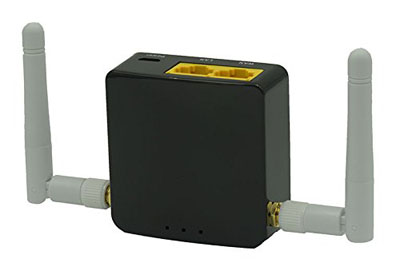

I hooked the display up to the GLi [AR-300M](https://www.gl-inet.com/ar300m/) running its stock firmware (OpenWRT with a custom web interface, although OpenWRT's own luci web-interface is also available under "advanced"). This is a TP-link knock-off (5 x 5 cm pcb), except it has two ethernet ports, more flash, more RAM and a PCIe connector that they say they will have a 5 GHz expansion board for at some point. This router set me back 35 euros on [Amazon](https://www.amazon.de/GL-AR300M-Ext-external-antenna-300Mbps-repeater/dp/B01K6MHRJI). If you're on a budget and want to play, the AR-150 model is 20 euros and should work just as well.

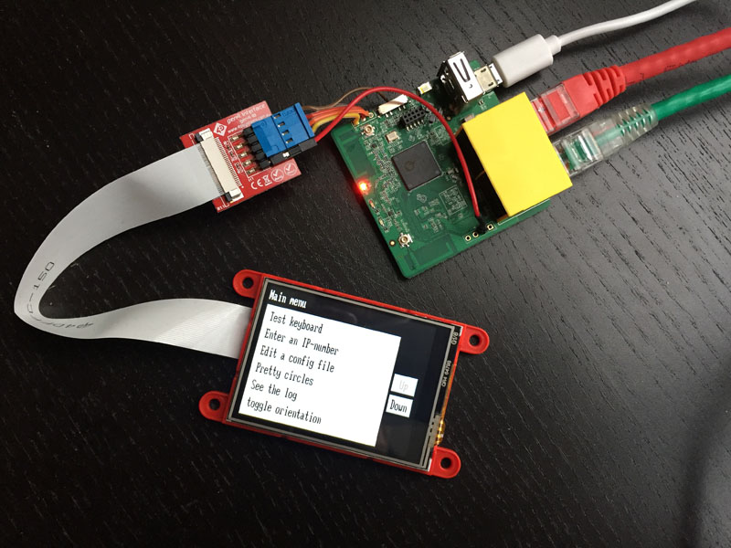

The serial port, power and ground are in the blue connector. 5 volts is not available on any header connectors on this access point, so that (brown) wire is soldered to the 5V on the USB connector pin on the bottom of the board. Note that the RX on the display goes to the TX on your access point or computer and vice versa. The extra red wire is for the reset. Turns out that even if you tell OpenWRT not to use the serial port as a console port (by putting a `#` in front of the line that says `askconsole` in `/etc/inittab`) the UBoot bootloader will still get confused if something talks back at it during boot. So my access point would not boot with the display attached. Instead of loading a new bootloader that did not use the serial port, I decided to see if the GPIO line (gpio 16) available on this board was maybe low during boot, so I could tie it to the reset wire to shut the display up during boot. I was lucky. As an added bonus, I can now also reset the display if it ever gets confused. Below, in the [building appliances](#building-appliances) chapter, you can see how this is used.

<br>
## `4D-Picaso.lua`, the display interface library

Alright, so we have the display hooked up to the serial port. Now we want to make things happen. To make pinapl, I decided to finally learn Lua, a programming language which is very well suited for these kinds of projects. If you want to use pinapl, you'll need to learn Lua. Which is fun, I promise. If you already speak C, PHP, Python, perl or really any other programming language, this should be easy. But even if you don't, Lua is a good choice for a first programming language: it's compact without being a straightjacket, and it is quite versatile. The book "[Programming in Lua](https://www.lua.org/pil/)" is a good resource to start with.

### dependency: `lua-rs232`

So, let's assume you have Lua installed on an OpenWRT system (`opkg install lua`). Next you'll need to be able to talk to the serial port. There is a Lua library for that, called `lua-rs232`, and the `4D-Picaso.lua` library that talks to the display depends on it. So we first install the serial library on OpenWRT: `opkg install lua-rs232`. Then copy the Lua files from this repository to some directory on the system. We used `/root/pinapl` as the directory to place the files from this repository in the examples.

### let's go!

Now we're ready to make things happen on the display. Create a file `circles.lua` and paste this in it. 

```lua
#!/usr/bin/lua

d = require("4D-Picaso")
d.init("/dev/ttyS0", 9600)	-- display wakes up at 9600 bps
d.setbaudWait(57600)		-- switch to 57600 bps
d.gfx_Cls()
while true do
	d.gfx_CircleFilled(math.random(0,319), math.random(0,239), math.random(10,50), math.random(0,65535))
end
```

Then type `chmod a+x circles.lua` and run it. If your display fills with pretty circles of different sizes, everything works. As you can see the library does all the work of talking to the display, and all you need to do is call functions from its namespace. I used the letter `d` to indicate the namespace of the display library, and all the examples here will assume that you did the same. As you can see we initialise the display at 9600 bps. We could have left off both the arguments to `d.init` since these are the defaults. The `setbaudWait` command tells both the display and the library to switch to a new speed.

The `gfx_Cls` command clears the screen, after which the `gfx_CircleFilled` function draws a series of filled circles with a center point randomly chosen on the screen, with a random radius between 10 and 50 pixels and a random 16-bit colour.  

Speaking of 16-bit colours: I made the function that parses the arguments so that any numeric value can also be a special colour string, in the hexadecimal HTML format: `#RRGGBB`, where `#FF0000` would code for red. My code then converts this to a 16-bit integer in the "5-6-5" format the display uses. (Losing a bit of colour resolution in the process, we are going from 24 to 16 bits, after all.)

There are commands for many things: drawing lines, printing text, changing font, you name it. The display commands, their parameters and return values can be found in the [PICASO Serial Command Set Reference Manual](http://www.4dsystems.com.au/productpages/PICASO/downloads/PICASO_serialcmdmanual_R_1_20.pdf) from the 4D-Systems website. If all you want to do is draw your own things to the display directly then you can stop reading this and just read that document.

It's important to remember that even if you use `pinapl`'s dialogs and menus that we'll talk about in a minute, you are still free to use the commands from this underlying display library directly.

> **Note:** I used 57600 bps when talking to my access point because I could not get 115200 bps to work between it and the display: the GL-iNet's listed serial speed is too far off the actual speed for the two to talk to each other. 115200 bps worked fine with my other project: talking to a [VoCore2 module](http://vocore.io/v2.html). More about that project soon.

<br>
## `pinapl.lua`, building applications

Drawing things directly to the display is fun, but writing anything useful can be time-consuming. You'd have to work out where to put things on the display, write code to poll any touch events. A lot of this work is what `pinapl` is built to do for you. With `pinapl`, all you need to do is call a function for a menu or text-input  to appear. This way, your code can concentrate on what the device is supposed to do.

getting started with `pinapl` is as easy as using the display library directly. All you need to do now is `require` both libraries and call `init` from `pinapl`. You'll see how that's done in the example below.

### Another (almost-)dependency: `luasocket`

`pinapl` depends on the `4D-picaso` library we talked about earlier (and through it, on `lua-rs232`). But it would also like to find the `luasocket` TCP/IP socket library. Not because it needs to speak TCP/IP, but because the `socket.gettime()` function can then be used instead of `os.time()`. The latter has a one second precision, where the socket library's function is much more precise (to 1/100's of a second). Precise time is useful, for instance to help detect how long a user is pressing a key. Without it, you may have to wait anywhere between 1 and 2 seconds for a context menu. On OpenWRT install the socket library with `opkg install luasocket`. Alternatively, comment out the `local socket = require("socket")` line in `pinapl.lua` (by placing `--` in front of it) if you are ok with 1-second precision.


### don't teach me, show me!

Here is the code for the example.lua application that is shown in the video at the top of the page. This is all of it.

```lua
#!/usr/bin/lua

d = require("4D-Picaso")	-- This allows you to talk to the display directly
p = require("pinapl")		-- This is the part that makes the dialogs, menus, etc

p.standbytimer = 180		-- Go to sleep if nothing pressed for this many seconds

p.init(d)					-- Initialise the port and the display

while true do

	-- Present the Main menu
	local options = {
		"Change hostname",
		"Edit a file",
		"See the log",
		"Reboot the system",
		"Pretty circles",
		"Toggle orientation" }
	local selected = p.listbox("Main menu", options, nil, nil, nil, true)
	
	if selected == "Change hostname" then
		-- Get current hostname
		local handle = io.popen("/sbin/uci get system.@system[0].hostname")
		local oldhostname = handle:read("*a")
		-- Strip off the newline at the end
		oldhostname = oldhostname:match("^([%a%d%-]+)")
		handle:close()
		-- Let the user enter a new hostname, present the old one as the default text		
		local hostname = p.input("Enter hostname:", oldhostname, nil, 63)
		-- Don't do anything if the user cancelled
		if hostname then
			-- Set the new hostname if the hostname is valid
			if hostname:match("^[%a%d%-]+$") then
				os.execute ("/sbin/uci set system.@system[0].hostname=" .. hostname)
				os.execute ("/sbin/uci commit system")
				os.execute ("/bin/echo " .. hostname .. " > /proc/sys/kernel/hostname")
				p.dialog("Success", 'Hostname changed to "' .. hostname .. '"', {"OK"})
			-- Otherwise show an error dialog
			else
				p.dialog("Error", '"' .. hostname .. '" is not a valid hostname. \
				  A hostname can only contain letters, numbers and hyphens (-)', {"OK"})
			end
		end

	elseif selected == "Edit a file" then
		p.editfile ( p.browsefile() )

	elseif selected == "See the log" then
		-- This is done this way because Lua's io.popen() blocks, even on read(0)
		os.execute("/sbin/logread >/tmp/logfile")
		os.execute("/sbin/logread -f >>/tmp/logfile &")
		p.viewfile("/tmp/logfile", p.wordwrap, true)
		os.execute("/usr/bin/killall logread >/dev/null 2>&1")
		os.remove("/tmp/logfile")
		
	elseif selected == "Reboot the system" then
		if p.dialog("Reboot?", "You are about to reboot. Are you sure?",
													{"Yes", "No"}) == "Yes" then
			os.execute("/sbin/reboot")
			p.dialog(nil, "Rebooting now...", nil, nil, 2, 3)
			while true do end		-- loop until reboot 
		end

	elseif selected == "Pretty circles" then
		p.clearscreen()
		-- getkeypress in do_not_block mode, so we can keep drawing pretty circles
		while not p.getkeypress(nil, nil, true) do
			d.gfx_CircleFilled(math.random(0, p.scr_w - 1), math.random(0, p.scr_h - 1), 
											math.random(10, 50), math.random(0, 65535))
		end
	
	elseif selected == "Toggle orientation" then
		-- scr_mode is the global variable containing the current mode
		if p.scr_mode == 0 then p.screenmode(2) else p.screenmode(0) end
		
	end

end
```

### eh, wait, that was too fast...

Don't worry if you don't understand everything that is going on in this example in detail. The stuff with `os.execute` and/or `uci` is OpenWRT-specific, you can ignore it if you're developing on something else or are just trying to understand how `pinapl` might help you. Also the code to show the logfile is a bit involved, feel free to ignore that.

What is important in the above example is that you get a feel for what complete appliance-like functionality looks like in code. I hope it inspires you to make your own things. Check the [function documentation](#pinapl-function-documentation) for a complete description of all the functions.

<br>
## Building appliances

Typically, you would want this display to work when your device boots. And since in many situations it will be the only user interface to the device, it better be running. I've created the following OpenWRT-specific init script to start our example program using a shell wrapper. Assuming the files from the repository are at `/root/pinapl`, you could save the following at `/etc/init.d/pinapl`:

```sh
#!/bin/sh /etc/rc.common
 
START=99
STOP=15
 
start() {        
	echo start
	/root/pinapl/pinapl-openwrt.sh &
}                 
```
Make this script executable and run it with `/etc/init.d/pinapl enable` to set it up to boot every time. On boot, it the following script, which you should save at `/root/pinapl/pinapl-openwrt.sh` (it also needs to be executable):

```sh
#!/bin/sh

echo 16 > /sys/class/gpio/export 2>/dev/null
echo out >/sys/class/gpio/gpio16/direction 2>/dev/null

cd /root/pinapl

while [ 1 == 1 ]; do
	
	logger -p user.info -t pinapl "Starting display"
	echo 1 > /sys/class/gpio/gpio16/value
	sleep 5
	logger -p user.info -t pinapl "Starting pinapl: example.lua"
	./example.lua > /tmp/pinapl.now 2>&1
	logger -p user.crit -t pinapl "`head -1 /tmp/pinapl.now`"
	cat /tmp/pinapl.now >> /tmp/pinapl.log
	echo 0 > /sys/class/gpio/gpio16/value
 
done
```

This second script gets executed by the first one. It will repeatedly call the interface code (so that it gets restarted in case of errors), resetting the display in-between and logging all errors to the system log. All of this is just a quick hack, naturally you can stick files in better places and make a more generic and generally more pleasing setup. That said: this runs rock-solid. The display works after boot and the restarting isn't necessary: the code and the display run for days without crashing once.

Note that these examples assume the reset of the display is at GPIO pin 16. You may have to modify your startup script. Or maybe you're working with a completely different system. Again: all of the above is just an example of how you could set things up to make a simple device with its own user interface.

## thinking inside the box ...

While I was writing `pinapl`, Till Butzmann made a pretty-looking enclosure for my tiny little AR-300M motherboard and the display (with the screw ears cut off) and 3D-printed it. This was done on a nice but still personal-grade 3D-printer, it can look even better on a professional one. Till is working on some final modifications and then the CAD-files for this enclosure will be published here. Let me know if you build something with `pinapl`, and I'll mention it here.

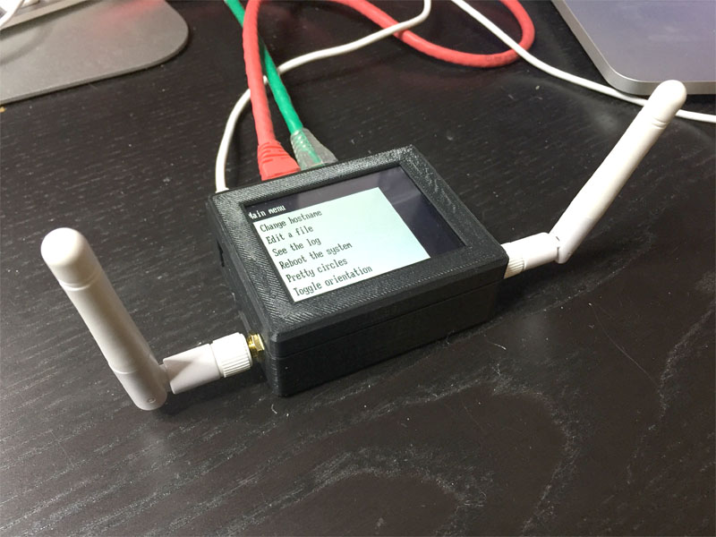

<br><br>

-----
# `pinapl` function documentation

All the examples below assume that you have set up the libraries in the way described before:

```lua
d = require("4D-Picaso")
p = require("pinapl")

p.init(d)	-- add a serial port device as second argument here if it isn't /dev/ttyS0
```
Many arguments to the functions are optional. If you want to use the defaults on some arguments but pass an argument that comes after, simply pass `nil` in the earlier arguments. 

<br>
## backlight

Turn the display's backlight on and off. Note that the display backlight is rated to take 30,000 hours to shine half as bright. That is roughly three years, so do not keep the display on all the time on an appliance that is going to be sitting in a corner somewhere. 

You should not need to to call this though, because generally you want the display to be in its own sleep state when it's not displaying anything. And even [`sleep`](#sleep) you probably don't want to call yourself, as the [`getkeypress`](#getkeypress) takes care of this after `standbytimer` seconds.

#### `backlight(state)`

### arguments

field | description
:---- | :----------
`state` | *(number or boolean)* if you pass `0` or `false`, the display's backlight is turned off, any other value will turn the backlight on.

### return values

`backlight` does not return any values.


<br>
## browsefile

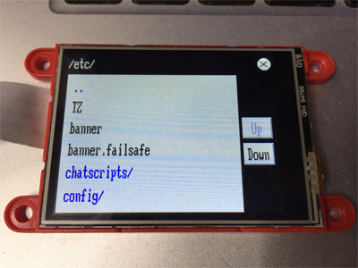

`browsefile` presents a file and directory picker. You might notice by its looks that it that uses `listbox` to display the files and directories internally. It allows the user to select a file (or a directory if used with `longpress` or `extra_button`).

Because `browsefile` returns `nil` if cancel is pressed, and `editfile` defaults to "/" and returns nil if called without arguments, the construction `editfile( browsefile() )` (as seen in `example.lua`) works. However, one might like to use the longpress feature to make context menus, maybe use an `extra_button` called "New" to create files/directories, etc, etc.

**IMPORTANT NOTE**:	browsefile currently only works on unix systems. That is: it assumes forward slashes  and it calls `ls` to do some of the work.

#### `browsefile([header], [dir], [longpress_time], [capture], [extra_button])`

### arguments

field | description
:---- | :----------
`header` | *(string)* Text printed in top-left of screen. Note that the current directory is appended to this, see below at `capture` for details
`dir` | *(string)* Absolute path to starting directory, may be with or without trailing slash.
`longpress_time` | *(number)* `longpress` return value is set true if the user holds a button for more this many seconds. Default is `0`, meaning no longpress detection. See `getkeypress` for more information.
`capture` | *(boolean)* If set to `true`, the user cannot `..` her way out of the starting directory, and paths are shown relative to this directory in the header. Useful if the user can edit notes of some kind but would better not be editing system config files.
`extra_button` | *(string)* If this is a text, the first `l_but_chrs` (default 4) of this are printed on an extra button shown in the listbox. If this button is pressed, the current directory is passed back, and the extra_button return value is true.

### return values

field | description
:---- | :----------
`path` | *(string or `nil`)* This will be `nil` only if the cancel button at the top right is pressed. Note that [`browsefile`](#browsefile) can only return a directory name (with trailing slash) in conjunction with `longpress` or  `extra_button`. Normally it would simply iterate into this directory and not return.
`longpress` | *(boolean)*
`extra_button` | *(boolean)*


<br>
## clearscreen

`clearscreen` does what it says on the box. It does not reset the various parameters (such as line spacing, underline, etc, etc) that the `gfx_Cls` function in the underlying display library resets. It simply draws a full-screen rectangle of the specified colour.

#### `clearscreen ([colour])`

### arguments

field | description
:---- | :----------
`colour` | *(number or string)* A colour can be passed as a 16-bit number or as an HTML colour string (e.g. `#FF0000` for red). If no colour is passed, the current default background colour (in the `background` variable) is used.

### return values

`clearsceen` does not return any values.
				

<br>
## dialog

`dialog` presents a dialog screen. It word-wraps and centres what's in `text`, and prints it above the buttons. Dialog screens do not have a cancel button in the top right: if you want users to be able to cancel, just mark one of the buttons accordingly.

```lua
if p.dialog("You've got a problem...", "Something bad happened. Continue?", {"Yes", "No"}) == "Yes" then
```

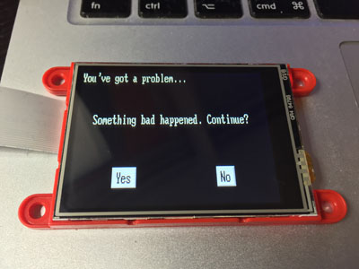

#### `dialog([header], text, [buttons], [font], [xscale], [yscale], [ygap])`

### arguments

field | description
:---- | :----------
`header` | *(string)* Text printed in top-left of screen.
`text` | *(string)* The text to be printed in center screen. Text is word-wrapped and both horizontally and vertically centred.
`buttons` | *(table)* A table of strings to be printed on buttons underneath the text. The screen is divided into as many columns as there are buttons, and each button is centred within its column. No special measures are taken in case this doesn't fit, so take care your buttons don't overlap. Make sure to also check with vertical screen if the user can switch orientation. If nil is passed in buttons, dialog renders the header and text and then returns immediately.
`font`, `xscale`, `yscale`, `ygap` | *(number)* Optional parameters determining how the display renders the text. Font is one of three system fonts (7x8, 8x8 or 8x12 pixels), times their x and y multiplication factors (xscale and yscale). ygap is the line spacing in pixels. All of these only used for the text itself, not for the header and the buttons, those follow the system defaults.

### return values

field | description
:---- | :----------
`button` | *(string)* The text on the button that was pressed. Or `nil` if no buttons were given.


<br>
## editfile

```lua
p.editfile("/etc/config/dhcp")
```

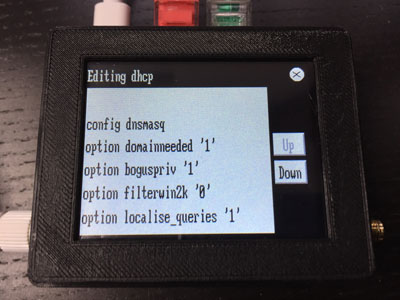

`editfile` is a self-contained file editor. It will show the lines from the file you are editing (using  [`listbox`](#listbox) internally) and allows editing any line in the file (using [`input'](#input) internally). If the user presses and holds a line, a context menu is shown. It allows for the deletion of that line as well as the insertion of a blank line before or after that line. If the user presses shift-Done while editing a line, the line is split at the cursor.

You can see a demonstration of the editor if you watch the video showing `example.lua` at the top of this page.

### arguments

field | description
:---- | :----------
`filename` | The name of the file to edit. This must be a text file, or unpredictable things might happen. If `nil` is passed instead, `editfile` returns `nil`, which allows for the `editfile (browsefile() )` construct from `example.lua`. 

### return values

field | description
:---- | :----------
`edited` | `true` if the file was saved, `nil` otherwise. 


<br>
## getkeypress

This is the routine where your applications are going to be spending most of their time. Almost all the other functions in this library eventually either block on a call to `getkeypress` (waiting for a key), or they are polling it in `do_not_block` mode in a loop. You can call it yourself too. You generally provide it with a list of rectangles and what you want getkeypress to return if they are pressed. (Or just pass `nil` as buttons to make the whole screen a button. `getkeypress` handles putting the display to sleep after `p.standbytimer` seconds.

#### `getkeypress([buttons], [longpress_time], [do_not_block])`

### arguments

field | description
:---- | :----------
`buttons` | *(table)* Each element in this table is another table that holds the coordinates of the left top and right bottom of the key rectangle (`x1`, `y1`, `x2`, `y2`) followed by a string with the name of the key. The name of the key pressed and released is returned by getkeypress. If no buttons array is passed then the entire screen is the button, and getkeypress will return "OK" when the user presses anywhere on the screen.
`longpress_time` | *(number)* `longpress` return value is set true if the user holds a button for more this many seconds. Default is 0, meaning no longpress detection. (In this case `getkeypress` will return on the touch, not on the release.) If `longpress_time` is set to true, `getkeypress` picks 1 or 2 depending on the availability of `socket.gettime()`. If the socket library is not available, the one second resolution of `os.clock()` causes longpress-detection to take anywhere between exactly 1 and exactly 2 seconds.
`do_not_block` | *(boolean)* As the name implies: this makes getkeypress non-blocking. Will return nil if no key is pressed. Unless you're sure that `getkeypress` just detected a key, the calling code needs to say `p.keytimer = p.time()` before calling `getkeypress` for the first time to use the standby timer, or set `p.keytimer` to `nil` if standbytimer is to be disabled. Note that if a `longpress_time` is also set, this will still work in `do_not_block` mode (and block for the time the screen is touched).

### return values

field | description
:---- | :----------
`keyname` | *(string or `nil`)* The string passed as the name for the button that was detected.
`x`, `y` | *(numbers)* The location on the screen that was pressed.
`longpress` | *(boolean)* `true` if the screen was pressed for `longpress_time` seconds, see above.


<br>
## init

Before you can start using the display, you call init. The proper order is to first `require` both libraries, then change any defaults and then call init. You'll notice that the `4D-Picaso` library also has an `init` function, but you don't need to call it if you use `pinapl`; its `init` will call the other one. So here's an example for how your code might start:

```lua
d = require("4D-Picaso")
p = require("pinapl")

p.standbytimer = 180
p.scr_mode = 2

p.init(d, '/dev/cua0', 9600, 19200)
```

The first line makes the functions of the display library available in the namespace `d`. What that means is that you can call these functions directly from your program if you put `d.` in front of them. Look at the "pretty circles" from `example.lua` to see how you might use these functions to talk to the display directly.

The second line does the same for the higher-level functions in `pinapl`, as `p`. Now that the defaults are loaded, we can overwrite some of them. You'll find all the defaults you can tinker with by just looking at the code in `pinapl.lua`. In this case we set the standby-timer to 3 minutes, and we make the screen start in a vertical orientation. (See [`screenmode`](#screenmode))

We then start talking to the display, set it to the desired speed, turn on its touch-screen, put it in the right orientation and so on, by running `init`. Init needs to be told where the library is that does the actual talking to the display, so we're passing it a pointer to that as the first argument. Then we use `/dev/cua0` as the serial port on our end, we start at the factory setting of 9600 bps and then take it to 19200 bps.

Note: if the display is set at a higher speed and init is called again, it will simply ignore that there's no display at 9600 bps and continue at the higher speed. I.e.: it will work if you call init again without resetting the display.

#### `init(4D-picaso, [port], [initial_speed], [working_speed])`

### arguments

field | description
:---- | :----------
`4D-picaso` | *(namespace)* Pointer to the namespace for the `4D-Picaso` library. 
`port` | *(string)* The serial device on your end that is used to talk to the display. Defaults to `/dev/ttyS0`.
`initial_speed` | *(number)* The speed that the display expects when it is powered on. Factory setting for the display, and default for `init`, is 9600 bps. This can be changed in the flash memory on the display if you use the 4D-Systems proprietary Windows software.
`working_speed` | *(number)* This is the speed the display will be set to first thing as `init` starts talking to it. Defaults to 115200. On some systems some actual serial speeds may be too far off. I had trouble getting it to work at 115200 with my Access Point, so I had to go down to 57600.

### return values

`init` does not return any values.


<br>
## input

```lua
new_hostname = p.input("Enter hostname:", current_hostname)
```

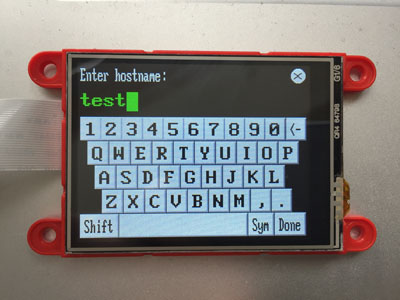

`input` allows typing. By default, it will either show a QWERTY keyboard like in the picture above (in landscape mode), or an alphabetically arranged vertical keyboard for the user to type on. The text will, by default, show in FONT3 (8x12), stretched 2x along both axes to 16x24. Once the edge of the screen is reached (15 chars in landscape) it switches to 8x24 characters (also the default size on all buttons). At 30 characters, the text starts scrolling to always show where the user is typing. An underscore under the last character on the left and the right will show if there is more text to show in that direction. By touching the left and right of the displayed text, the user can scroll around and place the cursor wherever she wants.

The shift key is sticky, meaning that it is pressed before and not during the keypress to be shifted. (This is a resistive touch screen, so there is no multi-touch). Normally shift turns grey when active and release after one more key. If you press shift twice it will lock (shown in red) and stay on for multiple keypresses. Shift-backspace will delete everything left of the cursor.

####`input([header], [defaulttext], [keyboard], [maxlen], [fixed_xscale], [password])`

### arguments

field | description
:---- | :----------
`header` | *(string)* Text printed in top-left of screen.
`defaulttext` | *(string)* The text that is already there when the user starts entering text. The cursor is placed after the last character of the defaulttext and the text is scrolled off the screen on the left if there is more than fits the display.
`keyboard` | *(string)* selects the keyboard. `pinapl` comes with a number of keyboard layouts, called `Normal`, `Sym`, `Num`, `Vertical` and `Vert_Sym`. If you specify a keyboard by name here, `input` will start with that keyboard. If you specify no keyboard, `input` will will pick either `Normal` or `Vertical`, depending on the orientation of the screen (see `screenmode`). Also see the text below on how to add a custom keyboard layout.
`maxlen` | *(number)* The maximum number of characters the user can enter. If this maximum is reached, the cursor turns red to indicate that the limit has been reached and no further keys (except backspace) are processed.
`fixed_scale` | *(number)* The horizontal stretch factor of the text that is being typed. Normally `input` figures this out for itself, printing a text nice and big if it's short enough, and then making it a step more condensed if it no longer fits the screen. Only the values `1` and `2` make much sense here, to lock `input` it to the small and the large size respectively.
`password` | *(boolean)* If this is `true`, any letters except the last one typed are replaced by stars. If `password` is set while there is a `defaulttext`, the user can not see the old password (but does know the number of characters) and can only enter that old password or type a new one.

### return values

field | description
:---- | :----------
`text` | *(string)* The text the user typed.
`shift_done_cursor` | *(number)* If the user ended their input with Shift-Done, this field will contain the cursor position, otherwise it will contain `nil`. In situations like text-editing, this can be used to allow the user to signal that a line of text needs to be split at the current location.

### Defining your own keyboards 

You can define your own keyboards for use with `input`. If you look at the code in `pinapl.lua`, you'll see the keyboard layouts in the beginning. You can add or modify a keyboard in your own code by adding a keyboard definition anywhere after the `p = require("pinapl")` statement. The numeric keypad `pinapl` provides has the phone layout (with the `1` in the left top). Say you want a numeric keyboard in calculator layout (with the `7` in the left top). In that case, we would just have the following code after that `require` statement:

```lua
p.keyboards['Calc'] = {
	{0},
	{30,'7','8','9',60,'<-| <- '},
	{30,'4','5','6'},
	{30,'1','2','3'},
	{60,'0','.', 60, 'Done'} }
```

Now to use this keyboard all you need to do is call `input` with `'Calc'` as the `keyboard` argument. 

Each element in the keyboards table is named after the keyboard and contains another table. This table hold a new table for each row of keys. Each element in this row is either a string with a key name or a number of pixels spacing before/between keys to be inserted. If the string for a key has a `|` in it, it means that the part after the `|` is displayed on the keyboard while the part before is what is returned as typed. Nothing says a key can only return one character, this allows for macros for words often typed.

The strings `Back`, `Done` and `<-` are special. `Back` returns to the previous keyboard (this works only one step deep), `Done` codes as the end of user input, and `<-` codes for a backspace. If the value returned by a key is the name of another keyboard, it is shown instead. Use upper case letters on the display, and their lower-case equivalent will be shown if shift is not pressed. Any single letter will be shown with an xscale of 2, any longer string will be condensed (xscale 1).

*If you were to look at the code, you'd notice that the `Normal` QWERTY-keyboard has spacings of `-1` for the keys on the top row. This makes keys overlap by one pixel and was a quick hack to make the keys on the top row fit neatly. Also note that if you do manage to use the 4D-Systems windows software to load a font with special characters on the display, `input` may need some work to deal with them. The `:lower()` function may not know the lower case equivalent of an accented letter, for instance.*


<br>
## listbox

`listbox` lets the user pick from a list of options. It will allow scrolling through a larger list by presenting 'Up' and 'Down' buttons to the right of the listbox if the list of options is larger than the screen. It detects long presses if you wish and has a host of other features that will come in handy when you see how listbox can be used to create higher level functionality such as `pinapl`'s built-in file browser and editor.

```lua
s = p.listbox("Some header", {"Option 1", "Option 2", {"#FF0000", "Option 3", "Lalala"}})
```

(This will display Options 1 through 3, where the third option is printed in red. On return s will be "Option 1", "Option 2" or "Lalala".)

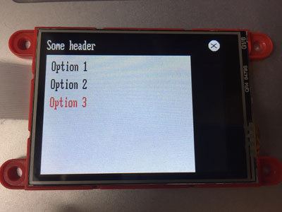

#### `listbox([header], options, [longpress_time], [offset], [extra_button], [no_cancel], [xmargin], [font], [xscale], [yscale], [ygap])`

### arguments

field | description
:---- | :----------
`header` | *(string)* Text printed in top-left of screen. The current directory is appended to this, see below at 'capture' for details
`options` | *(table)* A table of the options. Each element in the array can be a string or another table. If it's a string it is used as the displayed string and as the return value, and it is printed in the default colour. In case it's a table, the first element is taken to be an HTML colour string (e.g. "#FF0000" for red). If nil is passed as first element of this table, the default is used. The second element is the string to be	printed. If a third string is present, it is used as the return value for listbox when the user selects that option.
`longpress_time` | *(number)* `longpress` return value is set `true` if the user holds a button for more this many seconds. Default is 0, meaning no longpress detection. If set to true, a default longpress value is used. See `getkeypress` for more information on longpress.
`offset` |	*(number)* Set which element of the options table to display first.
`extra_button` | *(string)* If this is set, the first `l_but_chrs` (default 4) of this are printed on an extra button shown in the listbox. If this button is pressed, the text on the button is returned, with an index of 0
`no_cancel` |	 *(boolean)* If set to true, no cancel button is displayed. This is useful for top-level menus where there is nothing to cancel to.
`xmargin` |	*(number)* Number of pixels from left of listbox edge that the options are printed, default is 10.
`font`, `xscale`, `yscale`, `ygap` | *(numbers)* Optional parameters determining how the display renders the text. Font is one of three system fonts (7x8, 8x8 or 8x12 pixels), times their x and y multiplication factors (xscale and yscale). ygap is the line spacing in pixels. All of these only used for the options, not for the header and the buttons, those follow the system defaults.

### return values
				
field | description
:---- | :----------
`selected` | *(string or `nil`)* The option as displayed, or the third string in the option sub-table if present. <br>`nil` if `extra_button` was pressed.
`longpress` | *(boolean)* `true` if a longpress was detected, `nil` otherwise.
`index` | *(number)* The position of the option in the list, or 0 if `extra_button` was pressed.
`offset` | *(number)* Item at top of screen when the option was selected.


<br>
## screenmode

Screenmode turns the screen to a new orientation and clears the screen. Any of the four sides of the screen can be the top. `screenmode` sets three variables. `scr_w` and `scr_h` contain the width and height of the display in pixels respectively, and `scr_mode` holds the current mode. Your code would read the width as `p.scr_w`, if `pinapl` is referenced as `p` at the start of your program. The "pretty circles" menu option in `example.lua` makes use of height and width to figure out where to draw the circles, and the "Toggle orientation" option shows the use of `screenmode`.

Note that if `scr_w` is 240, the pixels on the screen are referenced from 0 to 239 in the `4D-Picaso` functions. 

#### `screenmode(mode)`

### arguments

field | description
:---- | :----------
mode | *(number)* 0 through 3 to indicate the new orientation of the screen. 0 means landscape with the flat-cable to the screen on the left, 1 is landscape the other way. 2 is portrait with the cable at the top, 3 is portrait the other way.

### return values

`screenmode` does not return any values.

<br>
## sleep

`sleep` calls the sleep function in the display, putting it in a low-power mode until the user presses anywhere on the screen for half a second or so. `sleep` will block until that happens. You typically do not need to call `sleep` yourself: [`getkeypress`](#getkeypress) takes care of this after `standbytimer` seconds. 

#### `sleep()`

### arguments

`sleep` has no arguments

### return values

`sleep` does not return any values.


<br>
## viewfile

```lua
p.viewfile("/tmp/logfile", p.wordwrap, true)
```

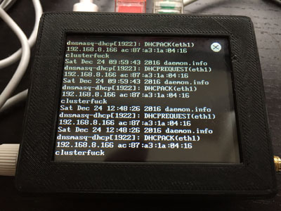

`viewfile` lets the user view any text file on the system. It allows for scrolling, it can cut, wrap or word-wrap lines and it has special features for files that may be growing while the user is looking at them, such as log files. `viewfile` is the log viewer in `example.lua`. Scrolling in the file is done by pressing the top or bottom one-third of the screen.

#### `viewfile(filename, [wrapfunction], [logmode], [font], [xscale], [yscale], [ygap])`

### arguments

field | description
:---- | :----------
`filename` | *(string)* The name of the file to be viewed.
`wrapfunction` | *(function)* This is a pointer to a function that can be used to wrap the lines in the file. This function is called for each line in the file, with the line as the first argument and the width of the screen in characters as the second. It must return a table with lines to be displayed, each maximally as long as the screen is wide. Here you can either pass a pointer to your own function (without brackets = pointer to function) or use on of the three built-in functions: `wrap`, `wordwrap` or `cut`. `wrap` simply wraps the lines around, breaking them wherever they hit the screen edge. `wordwrap` breaks at word boundaries, and `cut` just shows the first part of each line that is longer than the screen is wide. These three are functions in pineapple's namespace, so unlike your own function they need to be passed as `p.wordwrap`, etc. The default is `wrap`.
`logmode` | *(boolean)* By default the file loads and the user sees the beginning of the file. In `logmode` some special things happen. First of all the user sees the end of the file. If the file grows, the screen scrolls along. Furthermore, if the user scrolls back, the foreground colour changes (to yellow, unless you change the `vf_past_fg` default) to indicate that the screen is no longer scrolling when the file grows. As soon as the user pages all the way down, the letter become white again to indicate that the screen is now "locked to the bottom" as it were, scrolling when new lines are added to the file.
`font`, `xscale`, `yscale`, `ygap` | *(numbers)* Optional parameters determining how the display renders the text. Font is one of three system fonts (7x8, 8x8 or 8x12 pixels), times their x and y multiplication factors (xscale and yscale). ygap is the line spacing in pixels. `viewfile` by default uses FONT3 (8x12 pixels), with a gap of two pixels between the lines (`ygap`) to make things readable.

### return values

`viewfile` returns when the cancel button in the top right is pressed. It does not return any values.